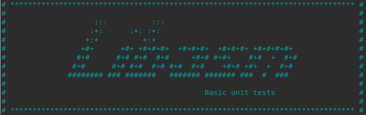
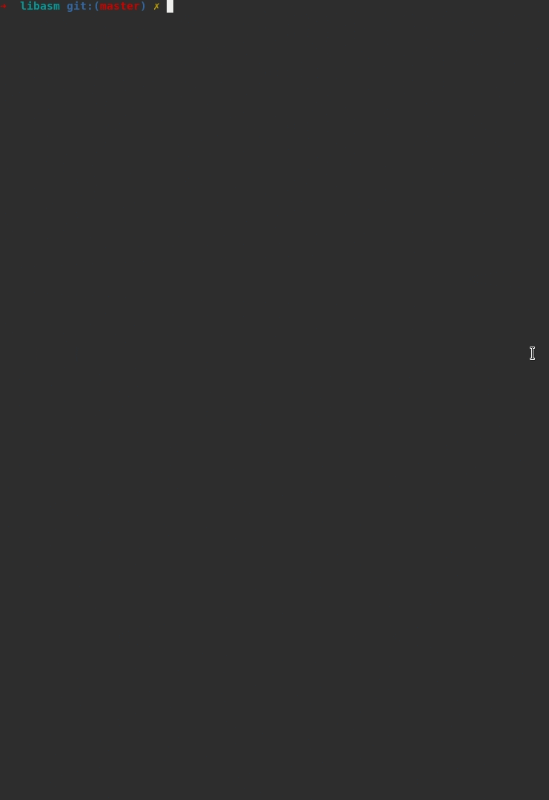

A basic yet complete tester for your [libasm](https://github.com/valentinllpz/libasm).

# 🧭 Usage


**You must have your Makefile ready before using this tester.**


1. `cd` to your libasm directory

2. `git clone https://github.com/valentinllpz/Libasm_Unit_Tests.git`

3. `cd ./Libasm_Unit_Tests/`

4. `bash test_libasm.sh` or `./test_libasm.sh`

5. You can test all your functions or select a specific one to test in the menu.


Note : Feel free to change your libasm path in `test_libasm.sh`:
```
libasm_path='../'
incl_path=$libasm_path
```

# ▶️ Demo



### Todos :
- [ ] Tests for bonuses. Feel free to make a pull request.


*Big up to @mli42 for improving this tester.* 
